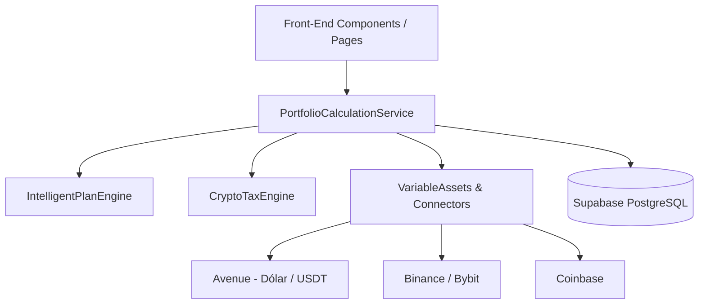

# Arquitetura Técnica do InvestVision Monthly (`docs/architecture.md`)

---
status: APPROVED
author: Equipe de Engenharia
last_updated: 2026-09-29
---

## 🏛️ Mapeamento de Módulos & Documentação Importada

Este documento consolida a especificação técnica do ecossistema InvestVision, integrando os dados de design do Figma, especificações de conectores de corretoras e os requisitos de cálculos financeiros.

---

## 💰 Regras Específicas de Integração por Corretora

### 1. Avenue - Dólar (EUA)
- **Ativos Mapeados**: `TSLA`, `META`, `USDT`, `BRK.B`, `GOOGL`, `IONQ`, `RGTI`, `AMD`.
- **Cotação de Câmbio Padrão**: Cotação em tempo real USD/BRL via AwesomeAPI / Yahoo (fallback `5.1322`).
- **Contabilização de USDT**: O USDT mantido em conta (`US$ 1.542,72` / `R$ 7.917,57`) é somado **integralmente** ao valor total da conta Avenue (`R$ 61.003,62`) e ao patrimônio global.

### 2. Binance / Bybit & Cripto
- **Propagação de Preço Médio**: Transferências de custódia mantêm o preço médio original de aquisição em BRL/USD para apuração de ganho de capital real.
- **Isenção Cripto**: Limite mensal de R$ 35.000 em vendas de criptoativos sem incidência de imposto nacional.

---

## 🛠️ Utilização de Workflows & Slash Commands

O workflow **/grill-me** (ou `//grillme`) é a ferramenta padrão para alinhamento interativo de contexto. Sempre que uma nova funcionalidade for adicionada:
1. Execute `/grill-me` no chat do Antigravity.
2. Responda às perguntas interativas sobre decisões de arquitetura, limites e UI.
3. Atualize os arquivos `Gemini.md` das pastas afetadas antes do PR.
