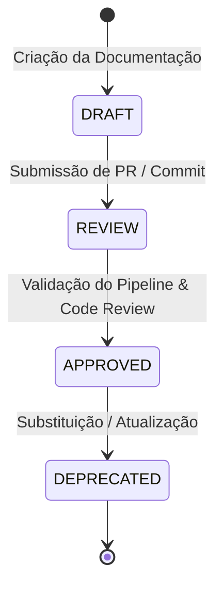

# Pipeline de CI/CD & Harness — Rastreamento de Ciclo de Vida de Documentos

---
status: APPROVED
author: Equipe de Engenharia
last_updated: 2026-09-29
---

## 🎯 Objetivo

Especificar a integração do pipeline do **Harness CI/CD** para automação de build, testes, validação de documentação (`Gemini.md`) e rastreabilidade das etapas de vida dos documentos.

---

## 🔄 Estágios do Ciclo de Vida dos Documentos



1. **`DRAFT` (Rascunho)**: Desenvolvedor ou assistente de IA inicia o arquivo `Gemini.md` ou especificação técnica.
2. **`REVIEW` (Revisão)**: Pull Request aberto. O Harness executa verificações de lint, testes unitários e aciona revisores.
3. **`APPROVED` (Aprovado)**: PR aprovado e mesclado na branch `main`.
4. **`DEPRECATED` (Depreciado)**: Documentos antigos sinalizados quando superados por novas versões.

---

## ⚙️ Exemplo de Pipeline Harness (`harness-pipeline.yaml`)

```yaml
pipeline:
  name: InvestVision CI & Documentation Lifecycle
  identifier: investvision_ci_doc_pipeline
  projectIdentifier: InvestVision
  orgIdentifier: default
  stages:
    - stage:
        name: Document Validation & Code Quality
        identifier: doc_validation_stage
        type: CI
        spec:
          cloneCodebase: true
          execution:
            steps:
              - step:
                  type: Run
                  name: Validate Gemini Docs & Markdown
                  spec:
                    command: |
                      echo "Validando sintaxe dos arquivos Gemini.md e links..."
                      npx markdownlint-cli "**/*.md"
              - step:
                  type: Run
                  name: Execute Vitest Suite
                  spec:
                    command: |
                      npm run test -- --run
              - step:
                  type: Run
                  name: Check Type Safety & Build
                  spec:
                    command: |
                      npx tsc --noEmit
                      npm run build
```
